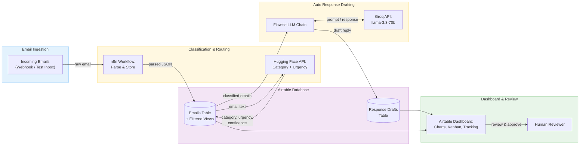

# Email Triage & Auto-Responder

An AI-powered email assistant that automatically classifies incoming emails by category and urgency, drafts context-aware responses using an LLM chain, and routes messages to the right queue for human review — all orchestrated through no-code automation tools.

🎥 **[Watch the Demo](https://canva.link/v68ae4d80oypoc1)**

## Team

| Name | Component | GitHub |
|------|-----------|--------|
| Rimsha Tahir | Email Ingestion, Classification & Routing | [@rimshatahir](https://github.com/rimshatahir) |
| Sabina Ruzieva | Auto Response Drafting | [@sabinova](https://github.com/sabinova) |
| Zainab Chaudhry | Integration, Testing & Dashboard | [@zainabc22](https://github.com/zainabc22) |

## Problem

Email overload is a universal workplace challenge. Important messages get buried, routine requests go unanswered for hours, and manual sorting wastes valuable time. This system automates email triage by classifying messages into categories and urgency levels, generating draft replies for common request types, and presenting everything through a clear dashboard — freeing humans to focus on what truly needs their attention.

## Architecture



> A full-resolution architecture diagram is also available at [`docs/capstone-architecture.png`](docs/capstone-architecture.png).

## How It Works

1. **Email Ingestion** — An n8n workflow captures incoming emails via webhook, parses the sender, subject, body, and timestamp, cleans the text with regex-based preprocessing, and stores the data in the Airtable Emails table with status set to `New`.

2. **Classification & Routing** — The same workflow sends each email to the Hugging Face zero-shot classification API (`facebook/bart-large-mnli`) for category classification (Question, Complaint, Request, Informational, Spam) and urgency assignment (Low, Medium, High). It writes the category, urgency, and confidence score back to the Airtable record, updates the status to `Classified`, and routes the email to the appropriate queue view.

3. **Auto Response Drafting** — A separate n8n workflow polls Airtable every 5 minutes for records with status `Classified`. For each one, it sends the email's category, urgency, subject, and body to a Flowise LLM chain powered by Groq (`llama-3.3-70b-versatile`). The chain generates a context-aware draft reply using a universal prompt with per-category behavioral rules. Drafts are stored in the Response Drafts table with status `NEEDS_REVIEW`, and the source email's status is updated to `Draft Generated`. Spam emails receive a `NO_DRAFT_NEEDED` sentinel and are filtered out before storage.

4. **Dashboard & Review** — Airtable Interface Designer views provide a pipeline status overview (records grouped by processing stage), an error monitor (filtered to records that hit issues), and a results feed showing completed drafts ready for human review. A human reviewer can approve, edit, or reject drafts before any response is sent.

## Tech Stack

| Tool | Purpose |
|------|---------|
| [n8n](https://n8n.io) | Workflow automation — email ingestion, classification, routing, and draft generation pipeline |
| [Airtable](https://airtable.com) | Shared database (Emails table + Response Drafts table), filtered views, and dashboard |
| [Hugging Face Inference API](https://huggingface.co/inference-api) | Zero-shot email classification and urgency detection (`facebook/bart-large-mnli`) |
| [Flowise](https://flowiseai.com) | Visual LLM chain builder for auto response drafting |
| [Groq API](https://groq.com) | Fast LLM inference backend (`llama-3.3-70b-versatile`) |
| [draw.io](https://draw.io) | Architecture diagram |
| [GitHub](https://github.com) | Version control, documentation, and collaboration |

## Airtable Schema

### Emails Table

| Field | Type | Written By | Notes |
|-------|------|-----------|-------|
| Sender | Single line text | Component 1 | Email address of sender |
| Subject | Single line text | Component 1 | Email subject line |
| Body | Long text | Component 1 | Full email body text |
| Timestamp | Date/time | Component 1 | When the email was received |
| Category | Single select | Component 1 | Question, Complaint, Request, Informational, Spam |
| Urgency | Single select | Component 1 | Low, Medium, High |
| Confidence | Number | Component 1 | 0.0–1.0 classification confidence score |
| Status | Single select | All | New → Classified → Draft Generated |
| Route Queue | Single select | Component 1 | General Questions, Complaints, Requests, Info, Spam Review |

### Response Drafts Table

| Field | Type | Written By | Notes |
|-------|------|-----------|-------|
| Draft ID | Autonumber | Auto | Unique identifier |
| Linked Email | Link to Emails | Component 2 | Foreign key linking draft to source email |
| Draft Body | Long text | Component 2 | AI-generated reply text |
| Status | Single select | Component 2/3 | NEEDS_REVIEW, APPROVED, REJECTED |
| Created At | Date/time | Component 2 | Timestamp of draft generation |
| Model Used | Single line text | Component 2 | LLM model identifier |
| Reviewer Notes | Long text | Component 3 | Space for human reviewer feedback |

## Repository Structure

```
ai-capstone-email-triage/
├── .github/
│   └── copilot-instructions.md
├── component-1-Rimsha/
│   ├── Email Ingestion, Classification & Routing System.md
│   ├── README.md
│   └── REQBIN_GUIDE.md
├── component_2_Sabina_auto-response/
│   ├── screenshots/
│   │   ├── emails-status-updated.png
│   │   ├── flowise-chain.png
│   │   ├── n8n-workflow-success.png
│   │   ├── reqbin-test.png
│   │   └── response-drafts-table.png
│   ├── README.md
│   ├── auto-response-drafting.md
│   ├── flowise-testing.md
│   ├── integration-testing.md
│   ├── prompt-testing.md
│   ├── reflection.md
│   └── testing-guide.md
├── component_3_Zainab_integration_testing/
│   └── README.md
├── data/
│   └── README.md
├── docs/
│   ├── capstone-architecture.png
│   ├── checkpoint2-audit.md
│   ├── checkpoint2-results.md
│   └── proposal.md
├── screenshots/
│   ├── ai-core.png
│   ├── dashboard.png
│   ├── emails-status-updated.png
│   └── ingestion.png
├── .gitignore
├── README.md
├── prompt-log-rimsha.md
└── prompt-log-sabina.md
```

## Component Details

### Component 1: Email Ingestion, Classification & Routing

**Owner:** Rimsha Tahir

Handles the full front-end pipeline — receiving raw emails via webhook, parsing and cleaning them, storing them in Airtable, then classifying each one by category and urgency using the Hugging Face zero-shot classification API. Records are routed to filtered queue views in Airtable based on their classification results.

**Key implementation details:**
- n8n workflow with webhook trigger for email ingestion
- Regex-based text cleaning and preprocessing
- Hugging Face `facebook/bart-large-mnli` for zero-shot classification
- Automatic urgency assignment (Low / Medium / High)
- Confidence scoring on each classification
- Route queue assignment for filtered Airtable views

→ [Component 1 Documentation](component-1-Rimsha/)

### Component 2: Auto Response Drafting

**Owner:** Sabina Ruzieva

Generates intelligent draft responses for classified emails using a Flowise LLM chain backed by Groq. The chain uses a universal prompt with per-category behavioral rules — complaints receive empathetic openings, questions get direct answers, requests get confirmation language, and spam emails are filtered out with a `NO_DRAFT_NEEDED` sentinel. Drafts are capped at 120 words and use bracketed placeholders for unknown information.

**Key implementation details:**
- Flowise chatflow: Chat Prompt Template → LLM Chain ← ChatGroq
- Model: `llama-3.3-70b-versatile` at temperature 0.7
- n8n workflow: Schedule Trigger (5 min) → Airtable Search → HTTP Request → IF filter → Airtable Create → Airtable Update
- Override config enabled for dynamic `promptValues` injection
- Endpoint: `https://cloud.flowiseai.com/api/v1/prediction/5707d01b-7614-4764-a388-fa5b0fe3f61d`

→ [Component 2 Documentation](component_2_Sabina_auto-response/)

### Component 3: Integration, Testing & Dashboard

**Owner:** Zainab Chaudhry

Owns the shared Airtable base design, test data creation, dashboard views, and end-to-end integration. Built three Airtable Interface Designer views: a pipeline status view (records grouped by processing stage), an error monitor (filtered to error states), and a results feed (completed drafts for human review). Managed the test dataset and coordinated cross-component integration testing.

→ [Component 3 Documentation](component_3_Zainab_integration_testing/)

## AI Capabilities

| Capability | Model / API | Purpose |
|-----------|------------|---------|
| Email Classification | Hugging Face — `facebook/bart-large-mnli` | Zero-shot categorization into Question, Complaint, Request, Informational, or Spam |
| Urgency Detection | Hugging Face — `facebook/bart-large-mnli` | Assign Low, Medium, or High urgency based on email content |
| Confidence Scoring | Hugging Face Inference API | 0.0–1.0 score indicating classification certainty |
| Response Generation | Groq — `llama-3.3-70b-versatile` via Flowise | Draft context-aware replies tailored to email category and content |

## Pipeline Flow

```
Email received via webhook
    → n8n parses sender, subject, body, timestamp
    → Stored in Airtable Emails table (Status: New)
    → Sent to Hugging Face for classification
    → Category, Urgency, Confidence written back (Status: Classified)
    → Auto-response n8n workflow picks up classified records
    → Sends to Flowise LLM chain for draft generation
    → Draft stored in Response Drafts table (Status: NEEDS_REVIEW)
    → Source email updated (Status: Draft Generated)
    → Dashboard displays results for human review
```

## Documentation

- [Demo Video](https://canva.link/v68ae4d80oypoc1) — Walkthrough of the full email triage and auto-response pipeline
- [Project Proposal](docs/proposal.md) — Full project plan with component breakdown, success criteria, and timeline
- [Architecture Diagram](docs/capstone-architecture.png) — Visual system architecture
- [Checkpoint 2 Results](docs/checkpoint2-results.md) — End-to-end pipeline test results
- [Checkpoint 2 Audit](docs/checkpoint2-audit.md) — Project readiness assessment

## Status

| Milestone | Status |
|-----------|--------|
| Project proposal and architecture diagram | ✅ Complete |
| GitHub repo setup and structure | ✅ Complete |
| Component 1 — Email Ingestion, Classification & Routing | ✅ Complete |
| Component 2 — Auto Response Drafting | ✅ Complete |
| Component 3 — Integration, Testing & Dashboard | ✅ Complete |
| End-to-end pipeline integration | ✅ Complete |
| Airtable dashboard views | ✅ Complete |
| Checkpoint 2 submission | ✅ Complete |
| Checkpoint 3 submission | ✅ Complete |
| Demo video recorded | ✅ Complete |
| Prompt logs (10+ entries) | ✅ Complete |
| Final documentation | ✅ Complete |